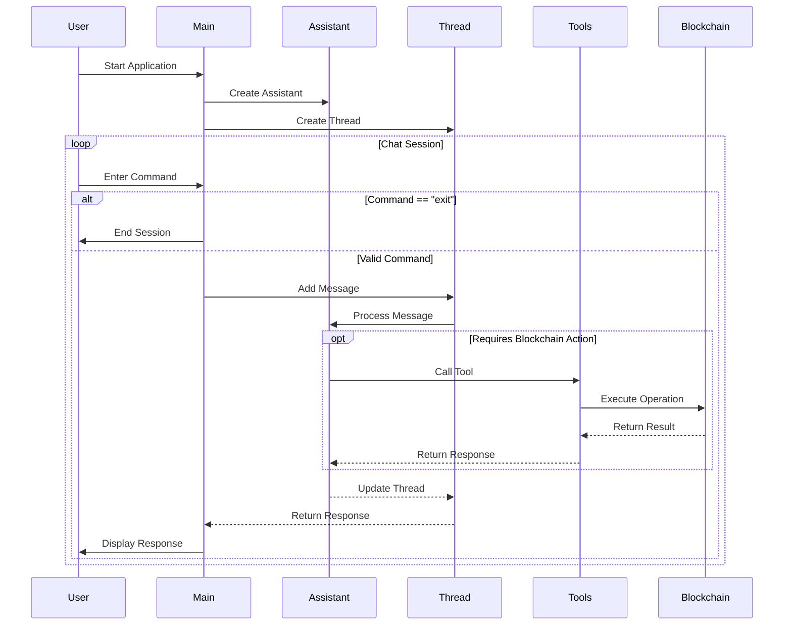

# Swell Terminal

## Description

**Swell Terminal** is a powerful terminal (CLI) designed to interact with [Swell network](https://www.swellnetwork.io/) using AI. It leverages OpenAI's models to provide a conversational interface for users to perform various blockchain operations, such as checking wallet balances, sending transactions, and more. 

There are already many frameworks designed to connect AI agents to Blockchain, but Swell Terminal goes one step further, with the following features:
- Lightweight, with few dependencies needed.
- Focused on the Swell ecosystem.
- Ability to execute several on-chain actions with a single instruction (for example: "send 1 SWELL to ... and then check the balance for ...").
- Entensible for restaking and other AVS. 


## Features

- **Conversational Interface**: Engage with the assistant to perform blockchain operations through natural language.
- **Wallet Operations**: Check wallet balances, retrieve connected wallet addresses, and more.
- **Transaction Management**: Send transactions (coins and tokens) with customizable parameters.
- **Error Handling**: Robust error handling and feedback for failed operations.

## Getting Started

### Prerequisites

- Node.js (version 14 or higher)
- TypeScript
- [OpenAI API key](https://platform.openai.com/) to enable the AI agent.
- A Swell/ETH wallet (private key)

### Installation

1. Clone the repository:

   ```bash
   git clone https://github.com/techgethr/swellterminal.git
   cd swellterminal
   ```

2. Install dependencies:

   ```bash
   bun install
   ```

3. Set up environment variables:
   Create a `.env` file in the root directory and add your OpenAI API key, private key for the wallet, and an assistant name:
   ```plaintext
      # OPENAI_API_KEY=************ enter your key here
      # WALLET_PRIVATE_KEY=**************** enter your key here (without 0x, just the rest)
      # ASSISTANT_NAME=******************* a name for your AI assistant
   ```

### Usage

To start the assistant, run:

```bash
bun run src/index.ts
```

You can then interact with the assistant in the command line. Type "exit" to end the conversation.

### Tools

The assistant has access to various tools for performing blockchain operations:

#### Read Operations
- Check wallet native balance (ETH) using get_balance
- Retrieve connected wallet address using get_wallet_address
- Get the total supply of a token using get_token_total_supply
- Get the balance for a specific token using get_token_balance


#### Write Operations
- Send coins and tokens using send_transaction
- Deploy ERC20 tokens using deploy_erc20

#### How to extend

1. Create the actions in the [src](./src/) folder
2. Create a new tool file in the [tools](./tools/) folder.
3. Add the function in the tool with unique name.
4. Register the tool in [allTools](./tools/allTools.ts)
5. Update the prompt (**in the prompt file inside the constants folder**) for the assistant to understand when it must run the tool.


## Codebase Flow

The following sequence diagram illustrates the core flow of the application:



### Diagram Explanation

The sequence diagram above shows the interaction flow between different components:

1. **Initialization**:
   - Swell Terminal starts with creating an OpenAI Assistant
   - A new Thread is created for the conversation

2. **Chat Session Loop**:
   - User enters commands through the CLI
   - Commands are processed through the Thread and Assistant
   - For blockchain operations in Swell, specific Tools are called
   - Results are returned through the chain of components

3. **Blockchain Integration**:
   - Tools interface with the blockchain through typescript sdks client
   - Operations are executed on the Swell network
   - Results are propagated back to the user

4. **Session Management**:
   - Users can exit the application at any time
   - Each command is processed in a sequential manner
   - Responses are displayed back to the user


## Team

**Company**: [Techgethr](https://www.techgethr.com/), a Blockchain and Web3 Venture Builder

1. Nestor Campos (developer): https://www.linkedin.com/in/nescampos/


## License

This project is licensed under the MIT License. See the [LICENSE](LICENSE) file for details.